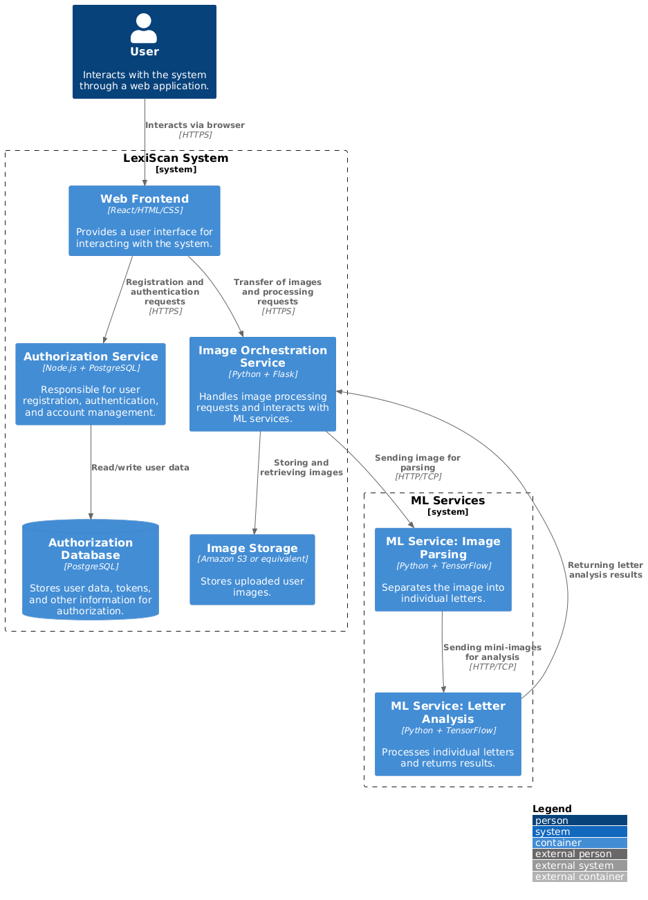

# LexiScan

c4 уровень контейнера

```
@startuml
!include https://raw.githubusercontent.com/plantuml-stdlib/C4-PlantUML/master/C4_Container.puml

LAYOUT_WITH_LEGEND()

Person(user, "Пользователь", "Взаимодействует с системой через веб-приложение.")

System_Boundary(lexiScanSystem, "Система LexiScan") {
    Container(webFrontend, "Веб-фронтенд", "React/HTML/CSS", "Предоставляет пользовательский интерфейс для работы с системой.")
    Container(authService, "Сервис авторизации", "Node.js + PostgreSQL", "Отвечает за регистрацию, авторизацию и управление учетными записями пользователей.")
    Container(orchestrationService, "Сервис оркестрации изображений", "Python + Flask", "Обрабатывает запросы на обработку изображений и взаимодействует с ML-сервисами.")
    ContainerDb(authDatabase, "База данных авторизации", "PostgreSQL", "Хранит данные пользователей, токены и другую информацию для авторизации.")
    Container(imageStorage, "Хранилище изображений", "Amazon S3 или аналог", "Сохраняет загруженные изображения пользователей.")
    Container(mlService1, "ML-сервис: Парсинг изображения", "Python + TensorFlow", "Разделяет изображение на отдельные буквы.")
    Container(mlService2, "ML-сервис: Анализ букв", "Python + TensorFlow", "Обрабатывает отдельные буквы и возвращает результаты.")
}

Rel(user, webFrontend, "Взаимодействует через браузер", "HTTPS")
Rel(webFrontend, authService, "Запросы регистрации и авторизации", "HTTPS")
Rel(webFrontend, orchestrationService, "Передача изображений и запросов на обработку", "HTTPS")
Rel(authService, authDatabase, "Чтение/запись данных пользователей")
Rel(orchestrationService, imageStorage, "Хранение и получение изображений")
Rel(orchestrationService, mlService1, "Передача изображения для парсинга", "HTTP/TCP")
Rel(mlService1, mlService2, "Передача мини-изображений для анализа", "HTTP/TCP")
Rel(mlService2, orchestrationService, "Возврат результатов анализа букв")
@enduml

```

in english: 
```aidl
@startuml
!include https://raw.githubusercontent.com/plantuml-stdlib/C4-PlantUML/master/C4_Container.puml

LAYOUT_WITH_LEGEND()

Person(user, "User", "Interacts with the system through a web application.")

System_Boundary(lexiScanSystem, "LexiScan System") {
    Container(webFrontend, "Web Frontend", "React/HTML/CSS", "Provides a user interface for interacting with the system.")
    Container(authService, "Authorization Service", "Node.js + PostgreSQL", "Responsible for user registration, authentication, and account management.")
    Container(orchestrationService, "Image Orchestration Service", "Python + Flask", "Handles image processing requests and interacts with ML services.")
    ContainerDb(authDatabase, "Authorization Database", "PostgreSQL", "Stores user data, tokens, and other information for authorization.")
    Container(imageStorage, "Image Storage", "Amazon S3 or equivalent", "Stores uploaded user images.")
}

System_Boundary(mlServices, "ML Services") {
    Container(mlService1, "ML Service: Image Parsing", "Python + TensorFlow", "Separates the image into individual letters.")
    Container(mlService2, "ML Service: Letter Analysis", "Python + TensorFlow", "Processes individual letters and returns results.")
}

Rel(user, webFrontend, "Interacts via browser", "HTTPS")
Rel(webFrontend, authService, "Registration and authentication requests", "HTTPS")
Rel(webFrontend, orchestrationService, "Transfer of images and processing requests", "HTTPS")
Rel(authService, authDatabase, "Read/write user data")
Rel(orchestrationService, imageStorage, "Storing and retrieving images")
Rel(orchestrationService, mlService1, "Sending image for parsing", "HTTP/TCP")
Rel(mlService1, mlService2, "Sending mini-images for analysis", "HTTP/TCP")
Rel(mlService2, orchestrationService, "Returning letter analysis results")
@enduml
```

